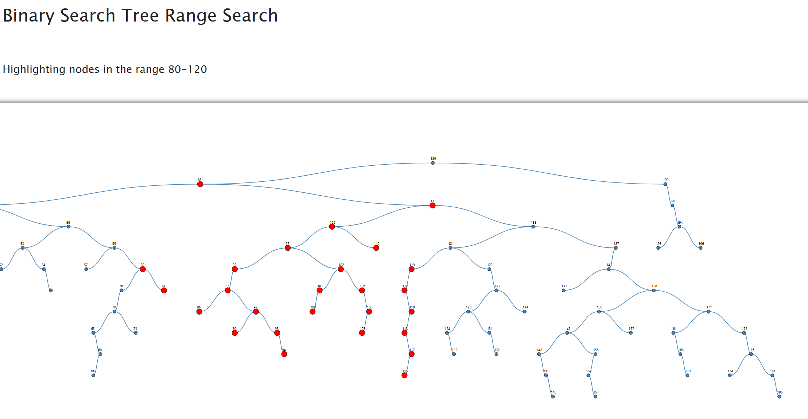
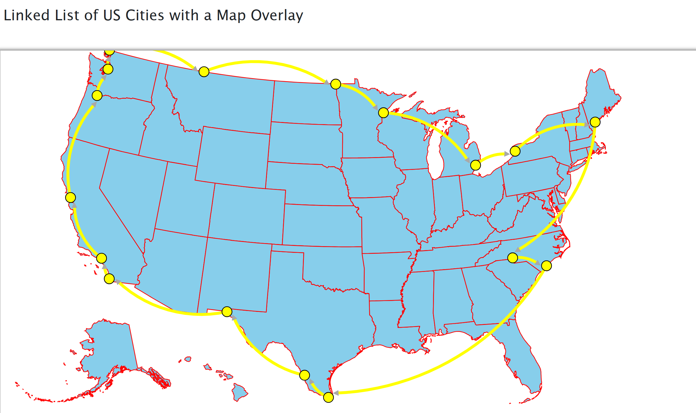
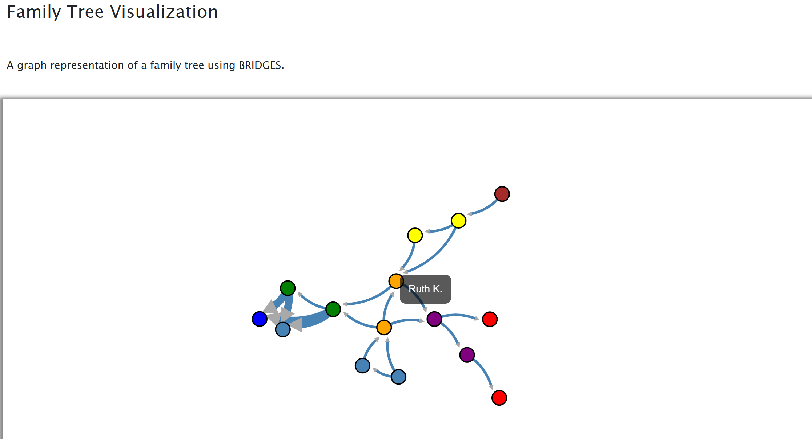
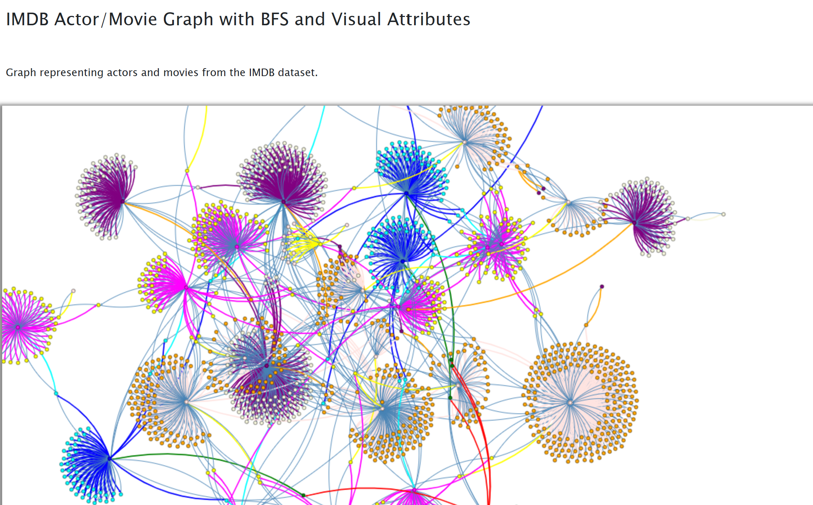
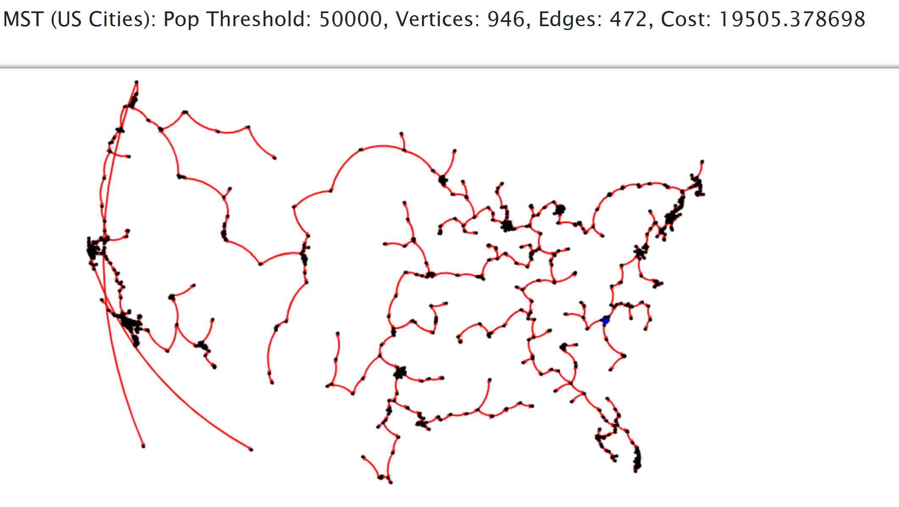

## Real World Algorithms

This repository showcases visual implementations of classic data structures and algorithms using the BRIDGES API. Each project demonstrates a different real-world application of concepts like graph traversal, sorting, tree structures, and geographic data visualization. 

Screenshots are included for each project to highlight how the algorithm is visualized through BRIDGES.

### 1. Binary Search Tree

Generates a BST with 100 random integers and highlights all nodes with keys in the range 80–120. Uses recursive range search and visualizes results with BRIDGES by adjusting node color, size, and shape.

**Key Concepts:**
- Recursive range search
- Binary search tree construction
- Visual data highlighting

### 2. Linked List of U.S. Cities

Creates a circular singly linked list of 17 U.S. border cities and displays them on a geographic map using BRIDGES. Cities are connected with visual links and placed according to their latitude and longitude.

**Key Concepts:**
- Singly linked list with custom node attributes
- Circular traversal
- Geographic visualization using real map coordinates

### 3. Family Tree Graph

Visualizes a family tree using a graph-based structure with labeled vertices for individuals and edges for relationships. Node colors distinguish family roles, and thicker edges highlight direct child-parent connections.

**Key Concepts:**
- Adjacency list graph representation
- Node coloring based on family roles
- Custom link thickness for visual emphasis

### 4. IMDB Actor/Movie Graph

Builds a graph of actors and movies from the IMDB dataset and runs Breadth-First Search (BFS) starting from Kevin Bacon. Each vertex is color-coded based on its level (Bacon number), and link thickness emphasizes traversal paths.

**Key Concepts:**
- Actor-movie graph construction
- BFS traversal from a root node
- Graph coloring based on level (distance from Kevin Bacon)
- Bi-directional edges and custom labeling

### 5. Minimum Spanning Tree (Prim’s Algorithm)

Builds MSTs using Prim’s Algorithm on both a small test graph and a real-world dataset of US cities, visualized geographically with BRIDGES. Cities are selected based on population thresholds, and Charlotte, NC is used as the root.

**Key Concepts:**
- Prim’s Algorithm on weighted, undirected graphs
- Geographic visualization of MSTs using city coordinates
- Distance-based edge weights using latitude/longitude
- Dynamic population filtering and graph generation

